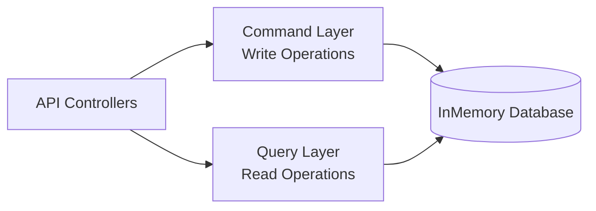

# 🚀 CQRS CRUD API (ASP.NET Core) — Full Example with Clean Architecture

[]()
[]()
[]()

This repository demonstrates a simple and beginner-friendly implementation of **CQRS (Command Query Responsibility Segregation)** in ASP.NET Core using a clean separation of **Write (Command)** and **Read (Query)** logic.

### Features

- ✔ Full CRUD with CQRS
- ✔ Command + Query Separated
- ✔ InMemory Database (No SQL Setup Required)
- ✔ Swagger UI Integrated
- ✔ Clean Architecture Structure

---

## 📂 Project Structure Overview

```yaml
CQRS-CRUD/
 ├── API/          → Controllers + Program.cs + Swagger Configuration
 ├── Command/      → Create, Update, Delete (Write Operations)
 ├── Query/        → Read Operations like Get All & Get ById
 ├── Common/       → DTOs + Response Wrapper
 ├── Data/         → ApplicationDbContext (InMemory DB)
 └── README.md     → You're reading it 😁
```

---

## 🧠 Why CQRS?

CQRS splits the system into:

| Command (Writes) | Query (Reads) |
|------------------|---------------|
| Create           | Get All       |
| Update           | Get By Id     |
| Delete           | Returns Data  |
| Changes Data     | Faster Reads  |

This improves **scalability, maintainability, readability and testability**.

---

## 🏗 Architecture Diagram



---

## ⚙ Run The Project

```bash
# Clone Repo
git clone https://github.com/your-user/cqrs-crud-api.git
cd cqrs-crud-api

# Build
dotnet build

# Run API
dotnet run --project ./API
```

Now open Swagger UI 👇  
🔗 http://localhost:5120/swagger

---

## 📌 API Endpoints

| Method | Endpoint             | Description          |
|--------|----------------------|----------------------|
| GET    | /Get-All-Students    | Get All Students     |
| POST   | /Create-student      | Create Student       |
| GET    | /Get-student-Id      | Get Student By ID    |
| PUT    | /Update-student      | Update Student       |
| DELETE | /Delete-student-Id   | Delete Student       |


### 📝 Example Body

```json
{
  "FullName": "Nirlaz Gnawali",
  "Age": "21",
  "Class": 1
}
```

### 📁 Example Response

```json
{
  "success": true,
  "message": "Student create succesfully",
  "data": "eacba6d5-77d9-4d3a-8add-755b1adb1780"
}
```

---

## 🛠 Tech Used

| Technology | Purpose |
|-----------|----------|
| ASP.NET Core (.NET 8+) | API Backend |
| EF Core InMemory       | Database |
| CQRS Pattern           | Read/Write Split |
| Swagger                | API Testing UI |

---

## 🔥 Upcoming Improvements

- Add Unit Tests (xUnit/Moq)
- Add FluentValidation
- Add MediatR Pipeline
- Optional Migration to SQL Server/PostgreSQL

---

## 🤝 Contribution

PRs & Improvements are always welcome!

```bash
git checkout -b feature/update-api
git commit -m "Added better CQRS handlers"
git push origin feature/update-api
```

⭐ Give this project a star if it helped you!
